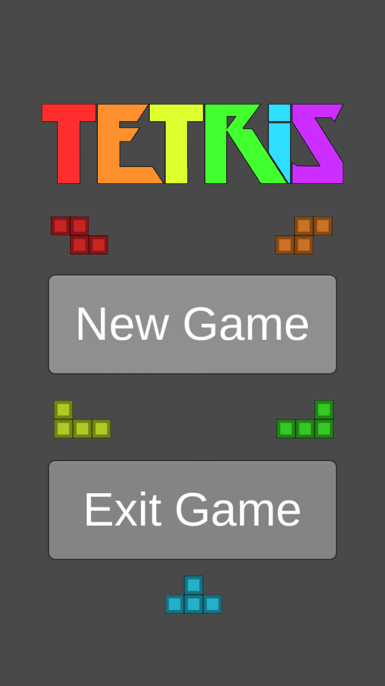
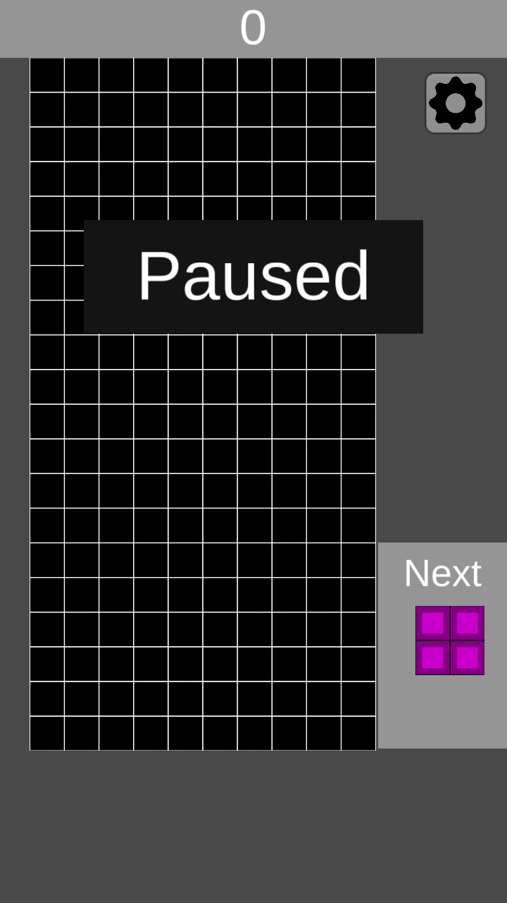
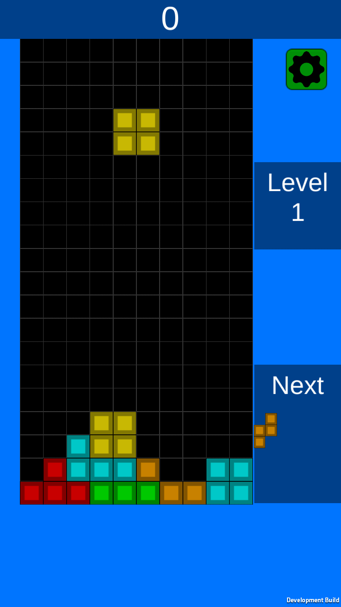
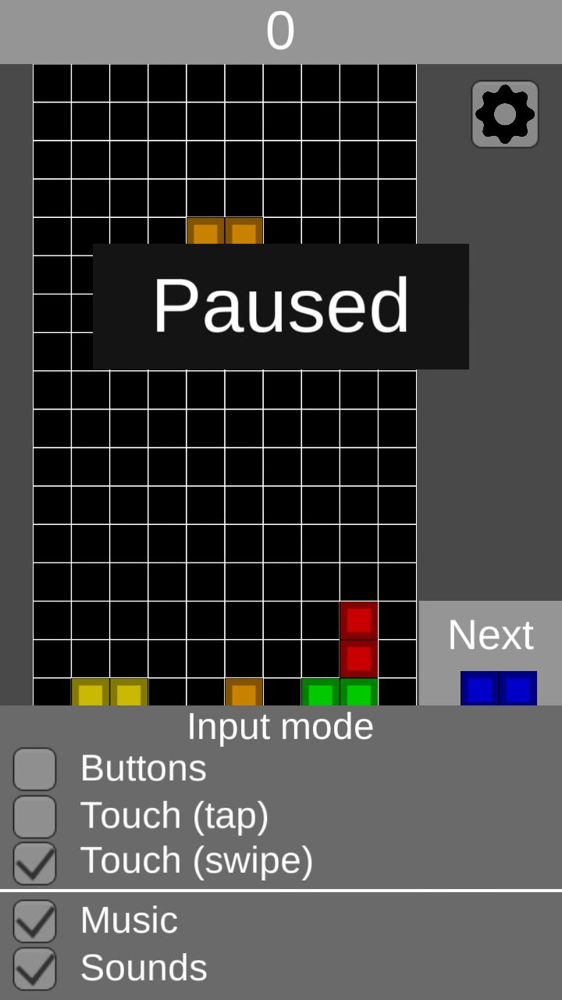
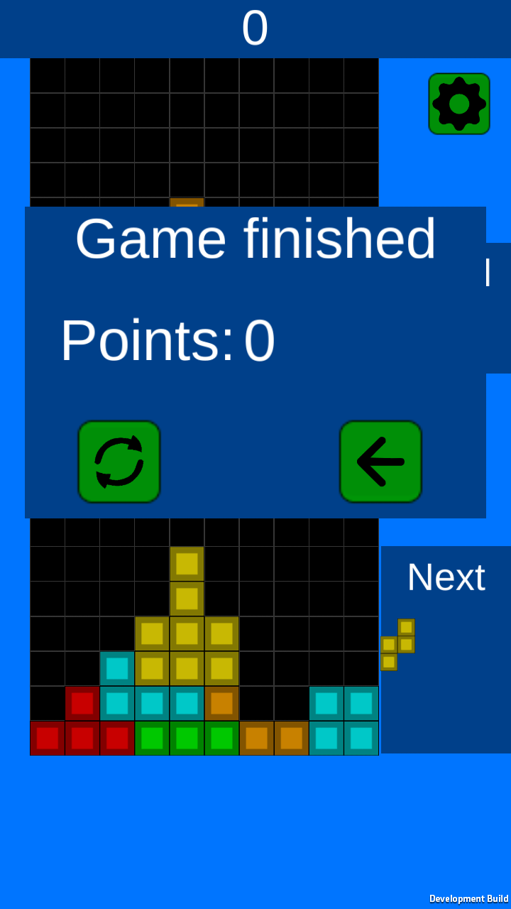
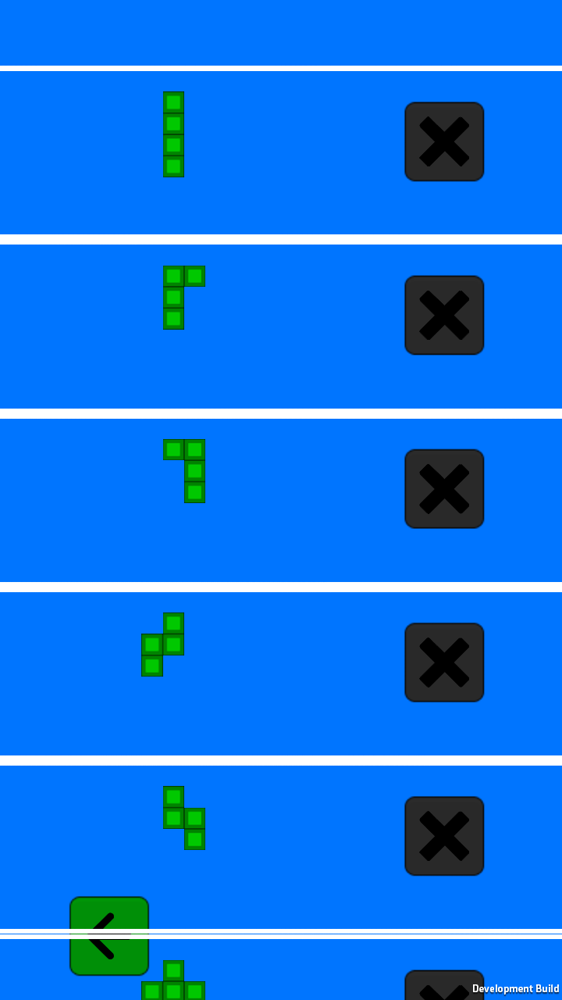
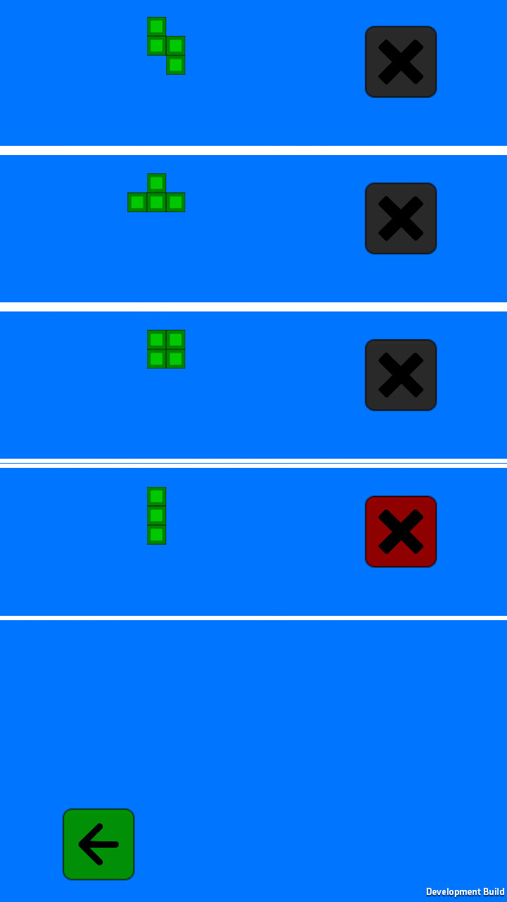

# Tetris
Tetris game in unity3D for Android  
Used Unity3D version: 5.3.5f1

## Game
Tetris is a tile-matching puzzle video game, originally designed and programmed by Russian game designer Alexey Pajitnov. It was released on June 6, 1984. "Tetriminos" are game pieces shaped like tetrominoes, geometric shapes composed of four square blocks each. A random sequence of Tetriminos fall down the playing field. The objective of the game is to manipulate these Tetriminos, by moving each one sideways (if the player feels the need) and rotating it by 90 degree units, with the aim of creating a horizontal line of ten units without gaps. When such a line is created, it disappears, and any block above the deleted line will fall.
[Wikipedia](https://en.wikipedia.org/wiki/Tetris)

## Screenshots

        
        
        </img>
        
        </img>
        
        </img>
        
        </img>
        
        </img>
        
        </img>
        
        </img>

